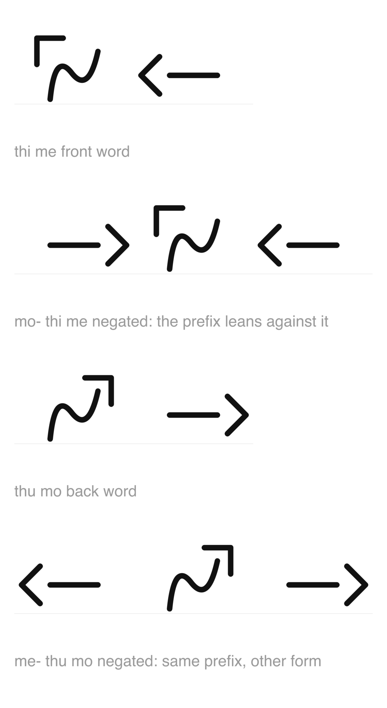

# Language notes

**Current decisions about ronosathwasha itself.** The original December 2023
Scrivener material is preserved in `notes/scrivener-language-notes.md`, and its
example sentences are transcribed in `data/examples.toml`. Those files are
historical evidence; later decisions recorded here take precedence.

Decisions 1, 5, 6, 7, 9, 10, 11, 12, 13 and 14 are implemented in the data files.
The rest are decided in principle and not written into `data/script.toml`,
because they are lexicon and grammar, and nothing in the font depends on them.

## 1. The affricates are gone

`ch` /tʃ/ and `j` /dʒ/ dropped. **Implemented**, in the font and the keyboard.
11 consonants, 132 syllables.

Two reasons, pointing the same way:

- **Fluid.** An affricate is the most abrupt segment there is, a full closure
  with a strident release. Everything remaining except `t` and `d` is a
  continuant.
- **Alien.** They were also the two most English sounds in the inventory,
  *church* and *judge*. What is left is a stop series of exactly /t d/, with no
  labial or velar stop anywhere, which almost no language does.

It also repaired the script for free, which is written up in the commit for
`df924f0`.

**The affricate repair is complete.** The canonical `[respell]` backlog in
`data/lexicon.toml` is currently empty. It remains the place for attested but
unwritable forms, because a second backlog is a second thing to get wrong.

## 2. Vowel harmony, on backness


**Front `i e`, back `u o`, neutral `ə a`.** A word's vowels agree on backness;
the central pair are transparent and appear in either class.

**The harmony domain is the phonological word, not the phrase or sentence.**
Independent words choose their classes independently. Harmony spans compounds
and bound morphology; negation is the sole deliberate exception.

Finnish's neutral vowels are front vowels behaving as transparent for
historical reasons, and everyone has to memorise that. **Here the neutrals are
neutral because they are actually central**, with no backness to agree about.
The phonology, the geometry and the harmony rule are one fact.

**The script displays it.** Backness is already drawn as direction, so a
harmonic word leans one way the whole length, and a break in harmony is visible
as a change of lean. No natural script does this, because none of them encode
backness geometrically.

**Harmony does not encode semantic classes.** Front harmony may feel lighter or
more abstract, and back harmony may feel heavier or more concrete, but those
are phonesthetic pressures rather than grammar. They may influence which coined
root feels right without obligating future vocabulary, assigning neutral roots
to an awkward third class, or turning exceptions into problems that need
explanations.

Roughly half the affixes would alternate:

```
alternating   -swo/-swe   -me/-mo   -the/-tho   -ne/-no   -di/-du   -yi/-yu   li-/lu-
neutral       -sa   ma-   anything whose only vowel is ə or a
```

## 3. Negation is anti-harmonic



**The negator takes the opposite class to the word it attaches to.** `mo-`
before a front word, `me-` before a back one. Always the wrong lean, so it is
visible at a glance and audible without being stressed.

The attested cousin is Turkish's invariant suffixes, `-yor` and `-ki`, which sit
in a harmonised word refusing to agree. This goes one step further: an invariant
morpheme only clashes half the time, and this clashes always.

Two arguments beyond the aesthetic:

- **Negation is the morpheme you can least afford to mishear.** Languages
  already protect it, by resisting reduction and attracting stress. This is a
  better mechanism than either.
- **The form matches the meaning.** The morpheme that contradicts is the one
  that refuses to agree.

Requires replacing `ma`, whose vowel is neutral and therefore has nothing to be
disharmonious with.

## 4. `ya` withdraws from the conversation

`ya` remains the third-person singular pronoun for something not alive. A
speaker may also use it self-referentially, deliberately replacing first-person
`la` with the nonliving `ya`.

Used alone, `ya` means that the speaker declines to present themself as an
animate participant. Context supplies the immediate reading:

- when exhausted: "I am too tired for this";
- after a request: "I do not want to";
- during an argument or incoming lecture: "I know, enough, stop";
- when presented with a consequence: "I do not care" or "not my concern."

These are not separate dictionary meanings. They are pragmatic consequences of
one stance: **the speaker is unavailable as an agent**. Functionally, it
occupies some of the same conversational territory as English *meh* and Spanish
*ya*, but reaches it through the language's existing pronoun system.

Applying `ya` to another living person instead denies that person's agency and
is pointedly rude. The self-directed use is conventional and usually comic,
weary or dismissive rather than self-abusive.

This decision does not establish a productive animacy marker for first- or
second-person pronouns, nor does it settle whether animacy can be reassigned to
ordinary nouns. Those remain open.

## 5. The lexicon predates harmony

**Harmony was decided after the language was already underway, so the inherited
lexicon was stale rather than authoritative about it.** A disharmonic entry was
an entry awaiting repair, not evidence about how harmony works.

This mattered because a stale entry was perfectly writable. Nothing in the font
or keyboard objected to `thino`, so it presented as current unless something
else said otherwise. Three states were needed during the repair:

| state | writable | consistent with current decisions |
|---|---|---|
| canonical | yes | yes |
| `[respell]` backlog | no | blocked on a later inventory decision |
| harmony-stale | **yes** | no |

**The canonical lexicon repair is complete.** The two roots requiring judgement
became `runə` ("dog") and `thinə` ("food"). `thinə` preserves the shape of
historical `thino` without colliding with existing `thina` ("drink").

The remaining repairs followed mechanically from the alternating affixes:

- front infinitives take `-swe`: `thinaswe`, `thinəswe`, `tiswe`, `miriswe`
  and `neswe`;
- back `roro` takes future `-tho`, producing `rorotho`;
- back `tuma` takes present `-mo`, producing `tumamo`;
- phrases and current sentence examples inherit the repaired forms.

The writable lexicon now contains no disharmonious entries, and the test suite
enforces that invariant. The historical Scrivener transcription and
`data/examples.toml` retain the attested forms unchanged.

**Two corrections to the 2023 record**, which the transcription preserves
faithfully and should keep preserving:

- **Subject and object are separate particles**, not one particle with two
  uses. Historical `ju` marks the subject and `yi` marks the object. Decision 7
  replaces only the subject particle.
- **`Ðayi runeyi time` glosses `-yi` as a subject marker**, which is a mistake
  in the source rather than an animacy rule. The current subject form begins
  `ðari`, not `ðayi`.

## 6. The autonym is repaired

**`ronosathwasha`.** **Implemented**, in `data/script.toml` and
`data/lexicon.toml`, in the commit for `32ea4c4`.

The name is `rono` + `sa` + `thwasha`, "people's language", and `rono` is `ro`
(back) plus the plural marker. The alternating set gives `-no` after a back
stem, so the name repaired itself by derivation rather than being rechosen.
Still five legal CV syllables, so it remains usable as the smoke test.

**The disharmony came from an affix, not a root.** `-ne/-no` alternates either
way, so repairing the autonym did not require settling the question marker.

`rone` ("people") became `rono` in the same change, as the first entry of the
repair pass that decision 5 implies.

**Still owed**: the font family name and the keyboard layout name are hardcoded
in `tools/build_ufo.py` and `tools/build_keylayout.py` rather than read from
`data/script.toml`, and the Python package, the UFO directory and the docs all
still say `ronesathwasha`.

## 7. The subject particle is `-ri/-ru`

Historical `-ju` is replaced by a harmonic pair: **`-ri` after front stems and
`-ru` after back stems**. A stem containing only neutral vowels takes the front
form. This gives the singular pronouns `lari`, `nari`, `ðari` and `yari`; the
back-vowel plurals become `loru`, `noru`, `ðoru` and `yoru`.

The choice does four jobs at once:

- `r` is an approximant, preserving the fluid sound of the language;
- the alternating vowel keeps the visible lean of a harmonic word;
- it contrasts with object `-yi/-yu` and possessive `-sa`;
- `-ru` closes into a recognizable loop in the formal script.

That loop gives back-harmonic subjects a repeated visual ending without adding
punctuation or another feature to the writing system.

**Implemented** in `data/lexicon.toml` and the current sentence page.

## 8. The formal script resists handwriting

**The script was designed for exact reproduction by the magical book network,
not for rapid handwriting.** Its geometric vowels, visible harmony and
carefully derived consonants make phonology inspectable, but they make a page
slow and awkward to produce with a pen.

That tradeoff fit the civilization that standardized it. A central council
could update the books directly, so faithful magical reproduction mattered more
than scribal convenience.

When the network failed, the script outlived the infrastructure it assumed.
Hand-copying became necessary precisely when authoritative copies stopped
appearing. Local shortcuts, degraded forms and incompatible cursive traditions
therefore became another pressure toward the language's later fragmentation.

## 9. Demonstratives deaffricate and move to mid vowels

The historical `chi` / `cha` / `chu` series becomes **`she` / `sha` / `sho`**:

| distance | current | historical |
|---|---|---|
| near the speaker | `she` | `chi` |
| intermediate or near the listener | `sha` | `cha` |
| far from both | `sho` | `chu` |

The consonant change is deaffrication: /tʃ/ loses its stop closure and leaves
/ʃ/. This preserves the original place of articulation while moving the series
toward the language's fluid sound.

The vowel change prevents proximal `shi` from colliding with the existing,
high-frequency locative `shi` ("at"). Avoiding the collision is about surface
texture as well as ambiguity: two common grammatical words should not make
`shi` recur throughout ordinary speech.

The new vowels also make deixis, contextual pointing, visible as a progression
through the vowel space: front `e`, central `a`, back `o`. The derived time
words follow mechanically:

- `sheme`: today, this-now;
- `shedwe`: today, this-day.

**Implemented** in `data/lexicon.toml` and the current sentence page. The
historical forms remain unchanged in `data/examples.toml` and the Scrivener
transcription.

## 10. Past, continuous and motion share new machinery

Historical `-je` becomes the harmonic past marker **`-se/-so`**. Historical
`-ji` becomes the harmonic continuous pair **`-di/-du`**: `-di` after front or
neutral stems, and `-du` after back stems.

The time vocabulary follows mechanically:

- `seme`: recently, past-present;
- `roroso`: far past;
- `rorotwathaso`: ancient past.

The old verb `jechi` is replaced rather than mechanically respelled.
**`medi` means "go," lexicalized from `me` (now) plus `di` (continuous).**
Its infinitive is `mediswe`.

Inflecting the new stem in the present continuous produces `medimedi`:
`medi-me-di`. The surface reduplication is not a separate rule. It is an
accidental consequence of the root's derivation, which is why it stays.

## 11. Affirmation answers the proposition

The standalone `so` ("yes") is retired. It sounded uncomfortably close to
Japanese *sō* in both form and conversational function, and `so` is now the
back-harmonic past marker.

**An ordinary affirmative repeats the predicate instead of returning a generic
word for "yes."** A question equivalent to "Do you eat?" is answered with "I
eat"; its negative answer repeats the negated predicate.

A separate corrective affirmative will reject a negative premise, serving the
role of French *si*. Its form remains open. This is a polarity correction, not
a politeness level.

The language has no grammatical politeness hierarchy. Its default register is
socially unmarked; impoliteness requires an explicit lexical or grammatical
choice, such as applying `ya` to a living person.

## 12. The rightward direction family begins with `ð`

The historical directional root `hi` is replaced with **`ði`**, preserving the
three related forms:

- `ði`: towards;
- `ðiðə`: right;
- `ðwiðə`: east.

The `w` infix still turns a body-relative direction into its compass
counterpart, just as `ni` / `nwi` gives up / north, `si` / `swi` gives down /
south, and `mi` / `mwi` gives left / west.

`ð` was the only consonant whose `-i` particle slot was genuinely unused.
Other consonants could form collision-free full direction words, but their
standalone `Ci` forms already carried grammatical or lexical meaning.

The repetition in `ðiðə` is intentional. Spoken /ði.ðə/ holds the dental
fricative while the vowel relaxes. In the script, the repeated consonant is
visibly transformed by two very different vowel marks: `i` adds an upper-left
angle, while `ə` encloses the second syllable in a ring.

**Implemented** in `data/lexicon.toml` and the current sentence page.

## 13. Cognitive roots share a phonestheme, not a suffix

The initial cognitive vocabulary is:

- `tonə`: know;
- `tonədu`: remember or retain, literally continue-knowing;
- `taya`: think;
- `meliya`: understand;
- `mwatheya`: believe.

Thinking is a cognitive process. Believing is a propositional state that
commits to an idea as part of the speaker's model of what is true.
Understanding is structural and remains distinct from possessing knowledge.
`tonədu` is transparent but conventionalized: the back-harmonic continuous
marker turns knowing into knowledge that continues. Its negation means "do not
remember" or "cannot recall," a present state rather than the event of
forgetting.

The recurring `-ya` in three of the four roots is a **phonestheme**: a sound
associated with a semantic neighborhood without having a stable compositional
meaning. It is not a suffix. Speakers may feel the relationship, and future
cognitive words may gravitate toward it, but attaching `-ya` does not
mechanically create a cognitive verb. `tonə` is not an exception requiring
repair because there is no grammatical rule to violate.

`roro` remains a productive intensifier rather than creating additional
dictionary entries. In context, `rorotaya` may mean contemplate,
`roromeliya` may mean comprehend deeply, and `rorotonə` may reach the sense of
"grok." These readings emerge from the intensified root and are not separately
lexicalized.

**Implemented** in `data/lexicon.toml`.

## 14. Language repair begins with existing machinery

Three conversation-repair words derive from established vocabulary and
grammar:

- `thwashamwu`: language-expression, from `thwasha` (language) plus `mwu`
  (thing);
- `thwashaswo`: to speak or say, the language noun made verbal;
- `teswe`: to ask, the front question marker `te` made verbal.

`thwashamwu` denotes a bounded piece of language without specifying its size.
In ordinary use, the smallest convenient language-thing is usually a word, so
"word" is its default reading. Context may widen it to an expression,
utterance, passage, or inscription.

`thwashaswo` does not yet absorb "tell." Saying content and telling a recipient
have different argument structures, so that extension needs an explicit
decision rather than an English gloss silently merging them.

**Implemented** in `data/lexicon.toml`.

## 15. Questions use `te-/to-`

The question prefix is **`te-` before front or neutral words and `to-` before
back words**. Questions are basic and frequent, so the marker remains one
syllable rather than avoiding a crowded grammatical namespace by becoming
longer.

The pair is distinct from future **`-the/-tho`**, whose suffix position and
dental fricative distinguish it structurally and audibly. This also gives the
future pair both of its authoritative declarations instead of leaving
back-harmonic `-tho` implicit in derived words such as `rorotho`.

For example:

- `Nari tethinəme?`: do you eat?
- `Ðari tororothwamo?`: does he, she, or it love?

The question marker's front form becomes the lexical root `te` when made
verbal. With no host selecting its conditioned back allomorph, the root takes
front infinitive `-swe`, producing `teswe`.

**Implemented** in `data/lexicon.toml` and the current sentence page.

## 16. Commands use `de-/do-` and stack compositionally

The command prefix is **`de-` before front or neutral words and `do-` before
back words**. Commands are basic and frequent, so the marker remains one
syllable and participates in harmony:

- `dethinəme`: eat;
- `demedime`: go;
- `dororothwamo`: love;
- `Layi demirime`: teach me.

Productive prefixes compose in the order **modality, negation, speech act,
predicate**. The suffixal tense remains after the predicate. This makes the
structure recoverable instead of lexicalizing each combination:

```text
lu + me + do + rorothwa + mo
might + not + command + love + present
```

The resulting **`lumedororothwamo`** means "maybe don't love." The negator is
the one licensed harmony violation: `lu-`, `do-`, the predicate and `-mo` are
back harmonic, while anti-harmonic `me-` visibly and audibly refuses to agree.

Predicate omission leaves **`mode`** or **`medo`** as a freestanding "don't,"
with the form preserving the harmony class of the action understood from
context.

**Implemented** in `data/lexicon.toml` and the current sentence page.

## Open

- **Vowel length.** Untaken, and the largest remaining fluidity lever. Both
  Finnish and Japanese are heavily length-contrastive and neither is doing that
  work here. It would sit on the vowel marks, not the consonants.
- **The corrective affirmative.** The language will distinguish ordinary
  affirmation from contradiction of a negative premise, as French distinguishes
  *oui* from *si*. The grammatical job is settled; the form is not.
- **Conversation repair morphology.** Explore two independent productive
  markers. A quotative particle would mark spoken or cited content, allowing
  `WHAT-QUOTATIVE?` to conventionalize as "What did you say?" with the
  recoverable predicate omitted, as Korean does with *뭐라고?*. An iterative
  marker would mean "again" on any predicate: say again, eat again, go again.
  Do not collapse these into one repair particle; each generalizes on its own.
- **A cessative marker.** Forget is not simply negated knowledge or memory. A
  general marker meaning "stop or cease doing" could derive forget from
  `tonə`, while also expressing stop eating, stop going, and stop speaking.
  The grammatical job is useful and productive; its form remains open.
