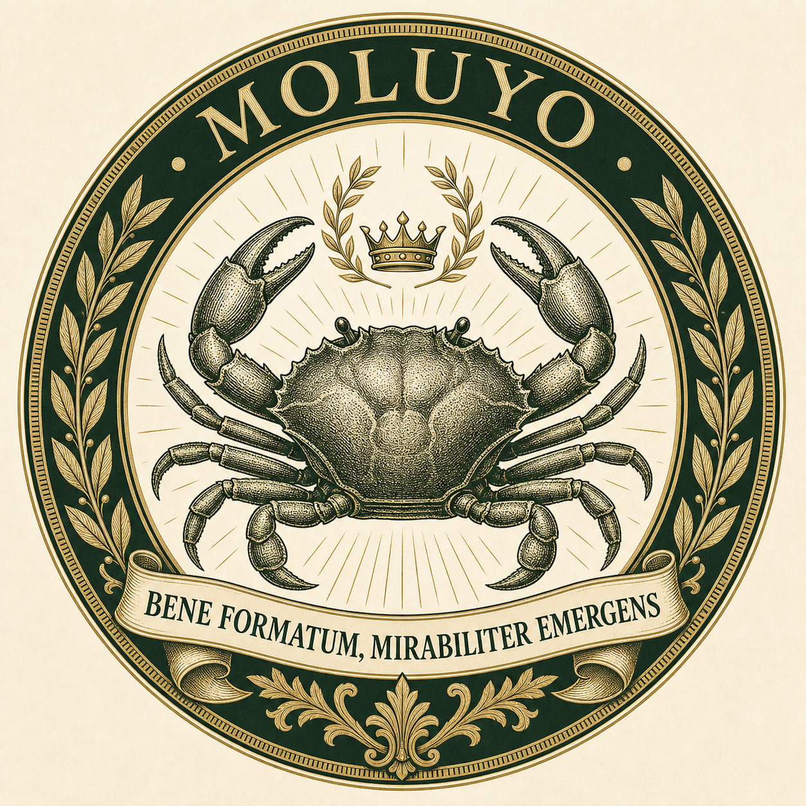
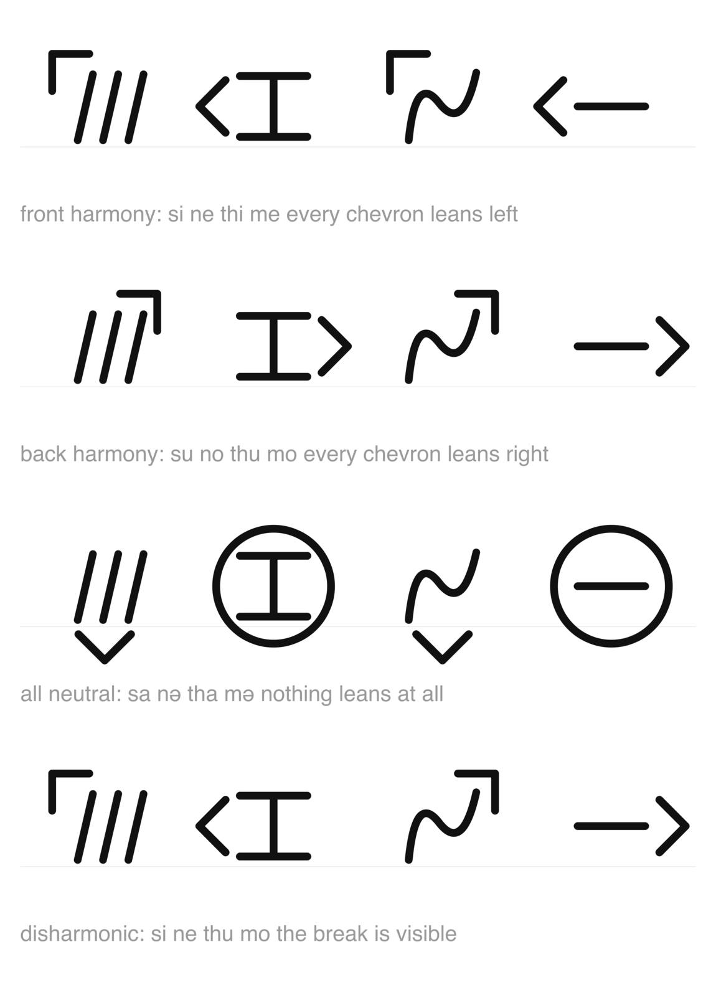
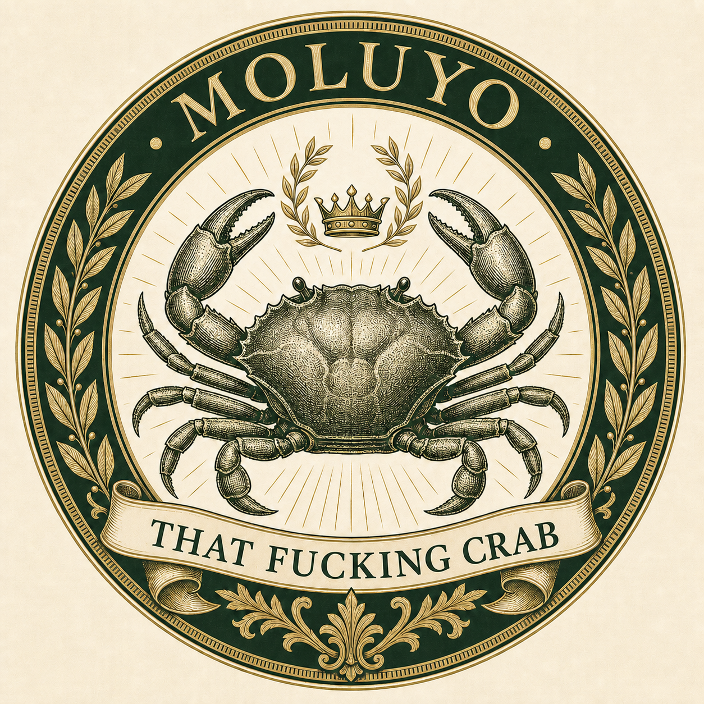

# ronosathwasha

<p align="center">
  
</p>

This started as a font for a constructed script I thought I had lost.

It got out of hand.

Ronosathwasha is now a constructed language, a featural syllabary, a macOS
keyboard layout, a generated reference site, and a Raku language-development
harness attached to a local model. The language is still being made. A lot of
the machinery exists so I can try to use it and find out what I forgot to
decide.

`ronosathwasha` is `rono` + `sa` + `thwasha`, "people's language". `Rono` is
the useful short form.

## The short version

The project has four connected parts:

- **The language.** Vocabulary, morphology, examples and attested utterances
  live in `data/`. Those files state what Rono is now.
- **The script.** Python turns one phonological declaration into a font, a
  macOS keyboard layout, a searchable dictionary and reference pages.
- **The grammar.** Raku parses words, realizes meanings, reads sentences back
  into structured intents and tests the boundary between them.
- **The researcher.** A local Qwen model, running through `llama.cpp`, tries to
  use the language and reports where the available pieces are insufficient.

The model does not get to invent Rono for me. That would be a different
project, and it would remove the fun part. It may combine declared pieces by
declared rules, but it may not invent roots, morphemes, grammar or exceptions.
It tries to use what exists. I decide what its failures mean.

## Start here

```sh
nix develop 'path:.'   # or just cd in, if direnv is active
make                   # list the useful targets
make all               # font, dictionary, pages and keyboard layout
make check             # Python, Raku and strict mypy
```

`make` re-enters the dev shell itself if the toolchain is not already on
`PATH`, so the targets also work outside direnv.

To poke the language directly:

```sh
make validate TEXT='Lari thinəme.'
make validate LEVEL=word TEXT='mothinəme'
make dict && open build/dictionary.html
make syllabary && open build/syllabary.html
make speak
```

The validator has three levels:

- `writing` checks whether the text can be represented by the script;
- `word` also checks word structure and harmony;
- `sentence` reads the sentence as grammar and reports what it means.

To install the font and keyboard layout on macOS:

```sh
make install
```

The installer builds both halves together on purpose. A font one encoding
behind its keyboard renders as fluent nonsense rather than as an error.

**The keyboard layout needs a log out and back in** because macOS only scans
that directory at login. Then enable it under System Settings > Keyboard >
Input Sources, under **Others**.

## The language

Rono is built from small pieces that are allowed to compose aggressively. A
noun can become a predicate. A predicate can take tense and aspect. The same
question morpheme can mark a clause or attach to a noun to derive "who",
"what", "where", "when" and "why".

That flexibility is deliberate. I want the grammar to generate consequences
instead of requiring every useful form to be written down individually. The
Raku side exists partly to find those consequences before I accidentally call
all of them intentional.

Some current rules:

- Every syllable is consonant plus vowel. There are no onsetless syllables,
  codas or consonant clusters.
- Front `i e` and back `u o` participate in vowel harmony. Central `ə a` are
  transparent.
- Harmony covers the phonological word, including bound morphology, but not
  the whole sentence.
- Negation is intentionally anti-harmonic. It always leans the wrong way.
- Subjects, objects, possession, tense, aspect, speech act and location are
  expressed with productive morphology.

The current decisions and their reasoning live in [`LANGUAGE.md`](LANGUAGE.md).
The original Scrivener notes survive under `notes/` as archaeology, not as
competing truth. **Every TOML file under `data/` describes the language as it
exists now.**

## The researcher

The chatbot is a language-development environment disguised as a
conversation.

The researcher is named Lauri. It is a Finnish name; he is not Finnish. I
picked it because Rono cannot pronounce it. `Lauri` begins with a diphthong,
and Rono has nowhere to put one. The nearest it gets is `laari`, one vowel
length away from `lari`, "I" with a subject marker.

Rono can call him `tayare`, "think-person". This is his nickname and,
regrettably for him, a perfectly valid derivation.

His job is to try to express real meanings using the language as it exists.
When the grammar cannot express one, or expresses something surprising
instead, he reports the problem rather than quietly inventing a workaround. I
can then decide whether Rono needs a word, a rule, an idiom or nothing at all.

Most of the plumbing exists: the model, parser, realizer, structured intent
protocol, conversation state, prompt construction, context budgeting and
`llama.cpp` transport. The conversation interface is not finished yet.

The selected model is Qwen3-14B at Q5_K_M, running locally with its native 32K
context. Its GGUF lives in `~/models/`, never in this repository. A model file
under the project would be copied into the nix store on every `path:`
evaluation, which is an exciting way to turn one ten-gigabyte file into a disk
space emergency.

The full design, including the model's authority boundary, is in
[`CHATBOT.md`](CHATBOT.md).

## The script

11 consonants times 12 vowels gives 132 syllables. Each syllable occupies one
code point in the Unicode Private Use Area.

The script is featural. Related sounds use related shapes instead of giving
every syllable an unrelated drawing.

- A vertical stem marks voicing: `t` becomes `d`, and `th` becomes `dh`.
- A crossbar marks a change of place: `s` becomes `sh`, and `l` becomes `r`.
- A vowel mark points toward its position in the vowel trapezoid.
- A glide adds a tick at the vowel mark's tail.

Backness is therefore both phonology and geometry. A harmonic word leans in
one direction, and the anti-harmonic negator visibly disagrees with it.



Every glyph is drawn as a centreline and stroked with one nib. Change `PEN` in
`sources/strokes.py` and the whole font changes weight.

The font uses the Private Use Area because this is not an encoded Unicode
script. That means the font is not decoration. **Without the matching font,
the text has no portable identity at all.** The same code points may render as
tofu or as somebody else's private alphabet.

## Typing it

The macOS layout is a dead-key state machine. A consonant key emits nothing and
arms a state; the following vowel emits the complete syllable.

Every consonant sits on the key used to romanise it. Shift marks the glide.
`H` is not a phoneme, so it completes the three digraphs.

| key | letter |
|---|---|
| `M` | m |
| `N` | n |
| `T` | t |
| `D` | d |
| `S` | s |
| `L` | l |
| `R` | r |
| `Y` | y |
| `H` | completes `th`, `dh` or `sh` |
| `A` `E` `I` `O` `U` `;` | a e i o u ə |
| shifted vowel | the corresponding glide |

To type the language's name:

```text
R  O   N  O   S  A   T H  Shift+A   S H  A
ro     no     sa     thwa           sha
```

Two things that look broken but are not:

- **A consonant appears to do nothing.** The layout is waiting for its vowel.
- **A vowel does nothing in the neutral state.** Rono has no onsetless
  syllables, so the keyboard refuses to manufacture one.

Numbers and punctuation remain Latin. Questions, commands and negation are
already morphological, but a question mark is still useful to anyone reading
the sentence, so the language is not going to pretend punctuation has become
obsolete.

## Dictionary and reference pages

```sh
make site
make serve             # build/ at http://localhost:8000
make share             # the same site through a public cloudflared tunnel
make serve PORT=9000
```

The dictionary contains every entry in `data/lexicon.toml`. It is searchable
by English gloss or romanisation, and every word is rendered in the script.
Conjugation tables come from the Raku morphology rather than a second copy in
Python.

**Serve `build/`, never `docs/`.** `docs/` contains the editable sources. The
build produces pages with the current font inlined, so they work on a machine
that has never installed it.

Inlining is necessary because the script uses private code points. A screenshot
loses the text; the text alone loses the glyphs. The page has to carry its own
decoder.

`make share` creates a public tunnel. Anyone with the URL can read the site
while it is running. The script checks that it owns the local port before
opening the tunnel, because accidentally publishing whichever process already
occupied port 8000 would be an extremely educational bug.

## How it fits together

```text
data/script.toml        phonology, code points and script derivation
data/lexicon.toml       declared words
data/morphology.toml    productive morphemes and their behavior
data/examples.toml      current sentence examples
data/utterances.toml    attested usage and provenance

ronosathwasha/          Python models for the script and font pipeline
sources/strokes.py      consonant letterforms as centrelines
sources/*.ufo           generated font source
layouts/                generated macOS keyboard layout

lib/Ronosathwasha/      Raku grammar and local-model harness
t/                      Raku tests
tests/                  Python, shaping and keyboard tests

tools/                  font, page, keyboard, speech and validator tools
docs/                   hand-written page sources and project images
notes/                  historical sources and design archaeology
config/chatbot.toml     local model, context and researcher configuration

LANGUAGE.md             current language decisions and their reasoning
SCRIPT.md               script decisions
CHATBOT.md              researcher and harness design
GLOSSARY.md             font and typography terms
```

The split is intentional:

- **TOML declares facts about the language.**
- **Raku owns linguistic behavior.**
- **Python owns typography and generated artifacts.**
- **`llama.cpp` owns local inference and model-specific tokenization.**

Nothing gets to quietly become a second authority.

## Generated files

`sources/Ronosathwasha.ufo` and
`layouts/Ronosathwasha.keylayout` are generated and overwritten by their
builders. Edit `sources/strokes.py` for letterforms and `data/script.toml` for
the inventory.

The test suite fails if either generated artifact has drifted from its source.
This is checked rather than remembered, because I am fallible meat and the
computer is here to reduce my cognitive load.

`build/`, `.raku/` and the model weights are not tracked.

## Moluyo

Moluyo is a very well-formed crab.

He emerged from a perfectly valid but deeply questionable piece of Rono and
became the patron of things whose structure is correct and whose consequences
are indefensible.

**Well formed does not imply sane. It is known.**

<details>
  <summary>The motto has a vernacular translation.</summary>

  <p align="center">
    
  </p>
</details>
